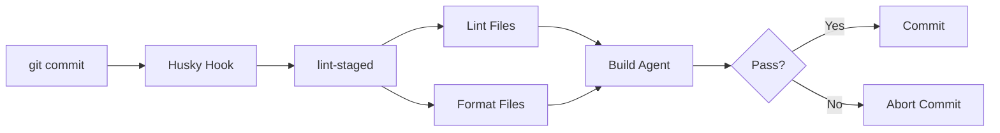
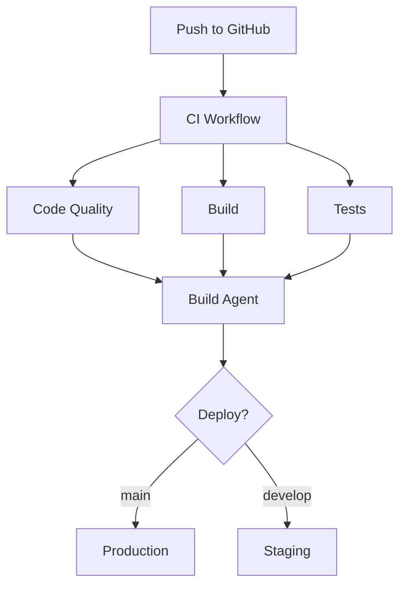
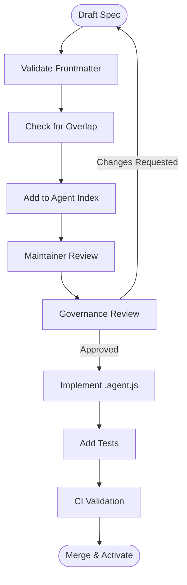
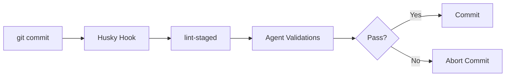
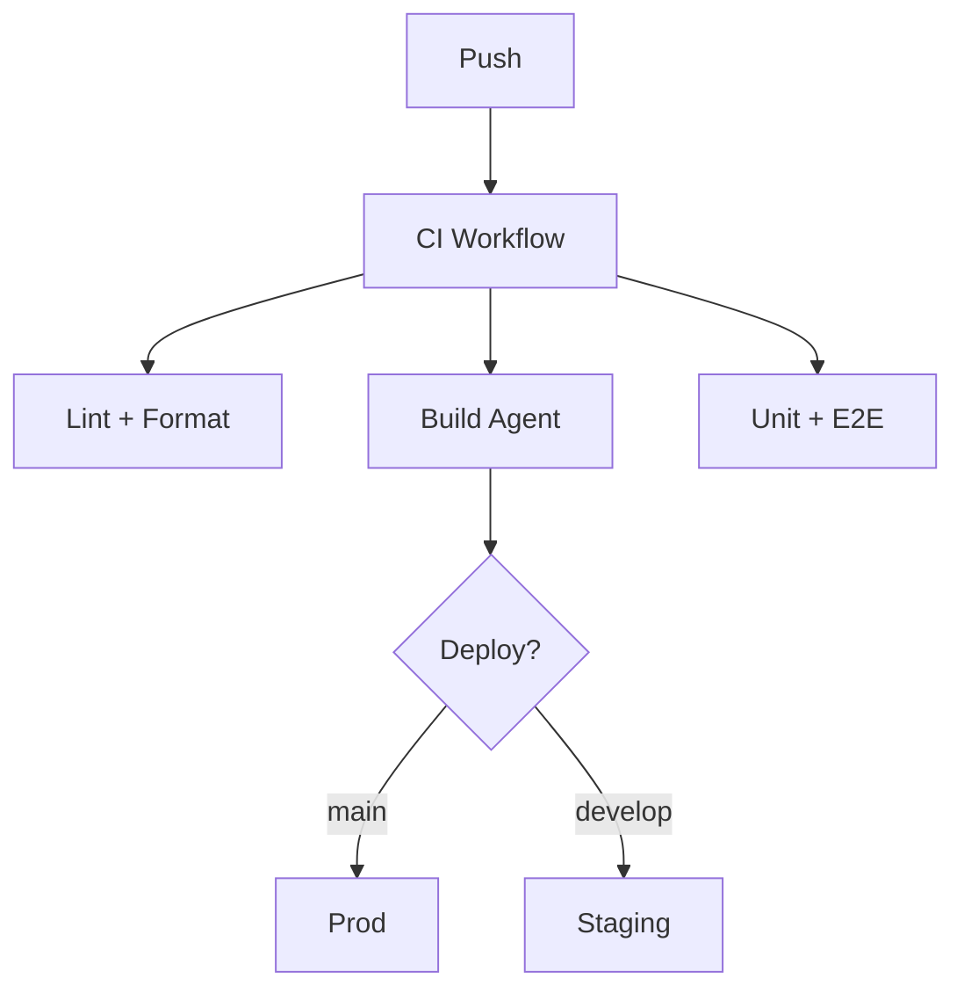

# AGENT_CREATION.md

**Human Governance for Creating New AI Agents in the Block Theme Scaffold**

This document defines how humans plan, draft, review, and publish new AI agent specifications for the **block theme scaffold**.
It ensures consistency, safety, long-term maintainability, and alignment with the scaffold’s existing AI automation system.

This guide complements:

- the **Agent Specification Template** (`template.agent.md`)
- the **block theme agents overview**
- the **organisation-wide AGENT_CREATION governance**
- the **Copilot agent instructions** (`agent-spec.instructions.md`)

## Overview

This theme includes AI agents that automate development tasks, maintain code quality, and assist with common workflows. Agents are configured in the `.github/agents/` directory.

## Available Agents

### Development Assistant

**Location**: `.github/agents/development-assistant.agent.md`

**Purpose**: Context-aware AI assistant that adapts to different development modes:

- **Build Mode**: Assists with build configuration, webpack, and compilation
- **Debug Mode**: Helps troubleshoot errors and issues
- **Documentation Mode**: Creates and updates documentation
- **Testing Mode**: Assists with writing and running tests

**Usage**: Agent automatically activates based on file context and user intent.

### Build Agent

**Location**: `.github/agents/block-theme-build.agent.md` and `block-theme-build.agent.js`

**Purpose**: Automates the build process for block themes:

- Compiles JavaScript and CSS
- Validates theme.json
- Generates asset manifests
- Runs linting and formatting
- Creates production-ready builds

**Usage**:

```bash
# Triggered automatically on:
- Git commits (via Husky pre-commit hook)
- GitHub Actions workflows
- npm run build command
```

**Features**:

- Mustache variable replacement in templates
- JSON validation for theme.json
- PHP syntax checking
- Asset optimization
- Version bumping

### Scaffold Generator

**Location**: `.github/agents/` (generator system)

**Purpose**: Creates new themes from this scaffold:

- Replaces template variables ({{theme_name}}, {{theme_slug}}, etc.)
- Validates required files
- Updates package.json and composer.json
- Generates initial documentation

**Usage**: See [GENERATE_THEME.md](./GENERATE_THEME.md) for complete guide.

## Agent Workflows

### Pre-commit Hook

Agents run automatically before commits:



### CI/CD Pipeline

Agents integrate with GitHub Actions:



# ---

# 1. Understanding the Existing Block Theme Agents

The scaffold already includes a mature set of automation agents. Before you consider creating a new one, you must understand these baseline capabilities.

## 1.1 Existing Agents

### **Development Assistant**

Location: `.github/agents/development-assistant.agent.md`
Purpose: A context-aware assistant that changes mode based on what the developer is doing.

Supported modes:

- Build Mode
- Debug Mode
- Documentation Mode
- Testing Mode

### **Build Agent**

Location: `.github/agents/block-theme-build.agent.md`
Purpose:

- Validate `theme.json`
- Compile JS & SCSS
- Optimise assets
- Generate manifests
- Run linting & formatting
- Ensure production-ready builds

Triggered by:

- Husky pre-commit
- GitHub Actions
- `npm run build`

### **Scaffold Generator**

Purpose: Generate full block themes from the scaffold.

- Processes variables ({{theme_name}}, etc.)
- Validates structure
- Generates documentation
- Updates package/composer metadata

Usage: See `GENERATE_THEME.md`.

---

# 2. When You Should Create a New Agent

Create a new agent if:

- A workflow is **repetitive**, **rules-driven**, or **document-heavy**
- It is **unique** to the block theme lifecycle
- Existing agents do **not** handle it
- Rules can be described **deterministically**
- Safety guardrails can be clearly written

Do *not* create a new agent if:

- The Development Assistant can handle the use case via a *new mode*
- The Build Agent already governs the workflow
- The behaviour requires unbounded judgement
- Workflow is unstable or still evolving
- There is no maintainer willing to own it

## Mermaid: Should You Add a New Block Theme Agent?

```mermaid
flowchart TD
    A([Identify Need]) --> B{Is workflow deterministic?}
    B -->|No| Stop1[Stop - Not suitable for an agent]
    B -->|Yes| C{Does an existing agent cover it?}
    C -->|Yes| Stop2[Extend existing agent]
    C -->|No| D{Is the workflow stable<br>and repeatable?}
    D -->|No| Stop3[Wait until stable]
    D -->|Yes| E{Can guardrails prevent harm?}
    E -->|No| Stop4[Redesign workflow]
    E -->|Yes| F([Begin Drafting Spec])
````

---

# 3. Pre-Creation Checklist (Block Theme Specific)

Before writing a spec:

- [ ] Confirm build tasks, theme.json processing, and file generation **do not overlap** with the Build Agent

- [ ] Confirm the Development Assistant cannot support this via a new mode

- [ ] Verify the workflow is **block theme–specific**, not org-wide

- [ ] Identify which directories the agent may read/write

- [ ] Define risks:

  - Theme build breakage
  - Invalid assets
  - Broken templates
  - Unrecoverable file mutations

- [ ] List out allowed tools (GitHub API, fs operations, linters, schema validators)

- [ ] Identify required logs and observability expectations

---

# 4. Block Theme Agent Architecture (Medium Overview)

The block theme scaffold blends:

- Node build tooling
- JSON/PHP theme validation
- Asset pipelines
- WP block configuration
- Documentation automation

## Mermaid: High-Level Block Theme Agent Architecture

```mermaid
flowchart LR
    Dev[Developer] --> Agents
    Agents -->|Validations| BuildAgent[Build Agent]
    Agents -->|Contextual Help| DevAssistant[Development Assistant]
    Agents -->|Generation| ScaffoldGen[Scaffold Generator]

    BuildAgent --> Output1[Optimised Theme Build]
    DevAssistant --> Output2[Guidance + Debugging]
    ScaffoldGen --> Output3[Generated Themes]
```

Agents must operate inside this architecture without disrupting:

- build processes
- manifest generation
- theme.json rules
- PHP template integrity
- file-based WordPress structure

---

# 5. Required Structure of the Agent Spec

All new agents must follow the canonical structure defined in:

`template.agent.md`

Required sections:

- Role & Scope
- Responsibilities & Capabilities
- Allowed Tools & Integrations
- Input Specification
- Output Specification
- Safety Guardrails
- Failure & Rollback Strategy
- Test Tasks
- Observability & Logging
- Changelog

---

# 6. Writing Clear Human-Focused Behaviour (Block Theme Rules)

When describing behaviour, ensure:

### ✔ Determinism

E.g.
“If theme.json contains an invalid schema, abort and report.”

### ✔ Predictable File Boundaries

Block theme agents must declare:

- Allowed directories
- Allowed write operations
- Who owns each file type (build agent, scaffold, developer)

### ✔ Strict Guardrails

E.g.:

- Must never modify `style.css` header metadata
- Must never remove required theme files (`theme.json`, `functions.php`)
- Must validate schema before generating files
- Must log every file mutation

### ✔ Minimal Scope

Agents should address only one domain:

- documentation
- pattern validation
- asset linting
- WP-specific config validation

Avoid multi-domain agents.

---

# 7. Block Theme Agent Creation Workflow

## Mermaid: Authoring Workflow



---

# 8. Integration With Existing Block Theme Automation

When creating a new agent, ensure compatibility with:

## 8.1 Pre-Commit Hooks

Agents integrate with Husky + lint-staged:



## 8.2 CI/CD Pipeline



Any new agent must **not interfere** with:

- build steps
- versioning rules
- asset generation
- theme.json validation

---

# 9. Common Use Cases for New Block Theme Agents

### Good candidates

- Pattern library auditor (validate `patterns/` folder)
- Style token synchronisation (link design tokens to theme.json)
- Template-part inventory checker
- WP block support validator
- Theme documentation synchroniser
- Screenshot builder (e.g., auto-generate `/screenshot.png`)

### Bad candidates

- Agents that change CI settings (org-level only)
- Global GitHub project automation
- Anything modifying multi-repo workflows

---

# 10. Safety & Guardrails (Block Theme Specific)

Block theme agents must explicitly forbid:

- modifying core scaffold files (`package.json`, `composer.json`, `webpack.config.js`)
- touching the build agent configuration
- altering theme version numbers unless explicitly designed to
- generating invalid block.json templates
- overwriting developer source files without backup

Rollback strategies MUST include:

- backup & restore
- validation before write
- descriptive error reporting
- abort on ambiguity

---

# 11. Test Requirements

All new agents must include:

- schema validation tests
- file mutation tests
- negative tests (invalid theme.json, invalid folder structure)
- dry-run mode tests
- logging/output verification

This ensures new agents do not destabilise builds.

---

# 12. Quick Start

```bash
cp .github/agents/template.agent.md .github/agents/my-agent.agent.md
```

Then follow:

1. Complete spec sections
2. Add guardrails
3. Validate frontmatter
4. Add to agent index
5. Implement `.agent.js`
6. Write automated tests
7. Create PR

---

# 13. Summary

This guide ensures that new agents:

- integrate safely with the block theme scaffold
- respect existing workflows and build processes
- maintain predictability and determinism
- include strict guardrails
- remain testable, auditable, and maintainable

By following this governance model, LightSpeed maintains a **high-trust, high-automation development ecosystem** for block themes.

---

## Resources

- [Main Agent Index](../.github/agents/agent.md) - Complete agent directory
- [GitHub Actions](https://docs.github.com/en/actions) - CI/CD documentation
- [Husky](https://typicode.github.io/husky/) - Git hooks documentation
- [lint-staged](https://github.com/okonet/lint-staged) - Pre-commit linting

## Summary

✅ **Automated Quality** - Agents maintain code standards
✅ **Consistent Workflow** - Same process for all developers
✅ **Error Prevention** - Catch issues before they reach production
✅ **Time Savings** - Automate repetitive tasks

For CI/CD workflows, see [WORKFLOWS.md](./WORKFLOWS.md).
For testing documentation, see [TESTING.md](./TESTING.md).
