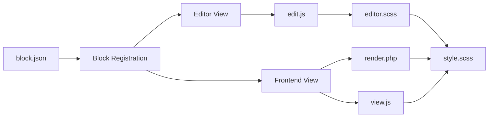

# Folder Structure & Naming Conventions

## Overview

This document provides detailed guidance on folder organization and naming conventions for the block theme scaffold project. It complements [ARCHITECTURE.md](./ARCHITECTURE.md) with practical rules and examples.

## Source Code Structure

### JavaScript Organization

```
src/js/
├── theme.js              # Main frontend script (entry point)
├── editor.js             # Editor enhancements
├── blocks/               # Custom block scripts
│   ├── card.js
│   └── testimonial.js
├── utils/                # Shared utilities
│   ├── dom.js
│   ├── helpers.js
│   └── constants.js
└── README.md
```

**Naming Rules:**

- File names: `kebab-case.js`
- Export names: `camelCase` or `PascalCase` (for classes)
- Variables: `camelCase`
- Constants: `UPPER_SNAKE_CASE`

**Examples:**

```javascript
// ✓ Good
export const handleBlockSelection = () => {};
export class CardBlock {}
const API_ENDPOINT = 'https://api.example.com';

// ✗ Avoid
export const handleblock_selection = () => {};
export class card_block {}
const apiEndpoint = 'https://api.example.com'; // Should be constant
```

### CSS/SCSS Organization

```
src/css/
├── style.scss            # Main stylesheet (entry point)
├── editor.scss           # Editor-specific styles
├── blocks/               # Block-specific styles
│   ├── card.scss
│   └── testimonial.scss
├── utilities/            # Utility classes & mixins
│   ├── variables.scss
│   ├── mixins.scss
│   ├── functions.scss
│   └── accessibility.scss
└── README.md
```

**Naming Rules:**

- File names: `kebab-case.scss`
- CSS classes: `kebab-case` (BEM notation)
- SCSS variables: `$kebab-case`
- SCSS mixins: `@mixin kebab-case`

**Examples:**

```scss
// ✓ Good
.wp-block-card { /* BEM root */ }
.wp-block-card__title { /* BEM element */ }
.wp-block-card--featured { /* BEM modifier */ }
$primary-color: #0073aa;
@mixin flex-center { display: flex; justify-content: center; }

// ✗ Avoid
.card { /* Too generic */ }
.card_title { /* Snake case */ }
.cardHighlight { /* camelCase */ }
```

### PHP Structure

```
inc/
├── block-patterns.php    # Pattern registration
├── block-styles.php      # Block style registration
├── template-functions.php # Template helpers
├── nonce.php             # Security utilities
├── deprecation.php       # Deprecated function handling
├── helpers/              # Utility functions
│   ├── class-helper.php  # Classes: class-* prefix
│   ├── function-*.php    # Grouped functions
│   └── README.md
└── README.md
```

**Naming Rules:**

- File names: `kebab-case.php` or `class-kebab-case.php`
- Function names: `prefix_kebab_case()`
- Class names: `PascalCase`
- Constants: `UPPER_SNAKE_CASE`

**Examples:**

```php
// ✓ Good (with namespace)
namespace BlockThemeScaffold\Helpers;

function register_custom_block_type() {}
class BlockPatternHandler {}
const THEME_VERSION = '1.0.0';

// ✓ Good (without namespace, with prefix)
function bts_register_custom_block_type() {}
class BTS_BlockPatternHandler {}

// ✗ Avoid
function registerCustomBlockType() {} // camelCase
class block_pattern_handler {} // snake_case
```

### Pattern & Template Structure

```
patterns/
├── header.php
├── footer.php
├── hero.php
├── cta.php
└── README.md

parts/
├── header.html
├── footer.html
├── sidebar.html
├── pagination.html
└── README.md

templates/
├── index.html
├── single.html
├── archive.html
├── search.html
├── 404.html
└── README.md
```

**Naming Rules:**

- File names: `kebab-case.php` or `kebab-case.html`
- Inside theme.json: use `slug` without extension

**Examples:**

```json
{
  "templateParts": [
    {
      "name": "header",
      "title": "Header",
      "area": "header"
    }
  ],
  "customTemplates": [
    {
      "name": "custom-page-builder",
      "title": "Page Builder",
      "postTypes": ["page"]
    }
  ]
}
```

## Test Structure

### JavaScript Tests

```
tests/js/
├── unit/
│   ├── utils.test.js
│   ├── helpers.test.js
│   └── blocks.test.js
├── integration/
│   ├── theme.test.js
│   └── editor.test.js
├── setup.js              # Test configuration
├── fixtures/             # Test data
│   └── mock-data.js
└── README.md
```

**Naming Rules:**

- Test files: `*.test.js` or `*.spec.js`
- Test suites: descriptive names
- Test cases: start with "should"

**Examples:**

```javascript
describe('Utils', () => {
  describe('parseJSON', () => {
    it('should parse valid JSON strings', () => {
      // test
    });

    it('should return null for invalid JSON', () => {
      // test
    });
  });
});
```

### PHP Tests

```
tests/php/
├── test-block-patterns.php
├── test-template-functions.php
├── bootstrap.php          # PHPUnit bootstrap
├── fixtures/              # Test data
│   └── sample-blocks.php
└── README.md
```

**Naming Rules:**

- Test files: `test-*.php`
- Test classes: `Test_*`
- Test methods: `test_*`

**Examples:**

```php
class Test_Block_Patterns extends WP_UnitTestCase {
    public function test_register_patterns() {
        // test
    }

    public function test_pattern_callback() {
        // test
    }
}
```

### End-to-End Tests

```
tests/e2e/
├── accessibility.spec.js
├── navigation.spec.js
├── blocks.spec.js
├── fixtures/              # Test data
│   └── pages.js
└── README.md
```

**Naming Rules:**

- Test files: `*.spec.js`
- Page objects: `page-name.js`
- Test cases: descriptive

**Examples:**

```javascript
// Page object
class HomePage {
  async navigate() {}
  async getTitle() {}
}

// Test
test('homepage loads correctly', async ({ page }) => {
  const homePage = new HomePage(page);
  await homePage.navigate();
  // assertions
});
```

## Log Folder Structure

### Organization

```
logs/
├── lint/                 # Linting output
│   ├── 2025-12-07-lint-dry-run.log
│   ├── 2025-12-07-eslint.log
│   ├── 2025-12-07-stylelint.log
│   └── 2025-12-07-php-lint.log
├── test/                 # Test execution logs
│   ├── 2025-12-07-jest.log
│   ├── 2025-12-07-phpunit.log
│   ├── 2025-12-07-e2e.log
│   └── 2025-12-07-lighthouse.log
├── build/                # Build process logs
│   ├── 2025-12-07-webpack.log
│   ├── 2025-12-07-babel.log
│   └── 2025-12-07-sass.log
└── agents/               # AI agent logs
    ├── 2025-12-07-theme-generator.log
    └── 2025-12-07-build-agent.log
```

**Naming Rules:**

- Format: `YYYY-MM-DD-{process-name}.log`
- One log per process per day
- Rotate or archive older than 30 days

**Examples:**

- `2025-12-07-lint-dry-run.log` ✓
- `2025-12-07-eslint.log` ✓
- `lint-2025-12-07-001.log` ✓
- `eslintOutput.log` ✗
- `linting_log.txt` ✗

### Log Format

```
[2025-12-07T10:30:45.123Z] [INFO] [lint-dry-run] Starting lint dry-run
[2025-12-07T10:30:46.456Z] [INFO] [lint-dry-run] Creating temporary files...
[2025-12-07T10:30:47.789Z] [INFO] [lint-dry-run] JavaScript linting: ✓ passed
[2025-12-07T10:30:48.000Z] [ERROR] [eslint] File.js:10:5 - Expected indent
[2025-12-07T10:30:49.111Z] [INFO] [lint-dry-run] Lint dry-run complete
```

**Log Levels:**

- `[DEBUG]` - Detailed diagnostic information
- `[INFO]` - General informational messages
- `[WARN]` - Warning messages
- `[ERROR]` - Error messages
- `[FATAL]` - Fatal/critical errors

## Report Folder Structure

### Organization

```
reports/
├── coverage/             # Code coverage reports
│   ├── 2025-12-07-js-coverage.html
│   ├── 2025-12-07-php-coverage.html
│   ├── coverage-summary.json
│   └── coverage-trends.json
├── performance/          # Performance data
│   ├── 2025-12-07-lighthouse.json
│   ├── 2025-12-07-lighthouse.html
│   ├── 2025-12-07-bundle-size.json
│   └── performance-trends.json
├── test-results/         # Test execution reports
│   ├── 2025-12-07-jest.json
│   ├── 2025-12-07-jest.html
│   ├── 2025-12-07-phpunit.xml
│   └── 2025-12-07-e2e.json
└── agents/               # Agent analysis reports
    ├── 2025-12-07-theme-generator.json
    ├── 2025-12-07-build-analysis.json
    └── agent-metrics.json
```

**Naming Rules:**

- Format: `YYYY-MM-DD-{report-type}.{ext}`
- JSON for data/metrics
- HTML for visual reports
- XML for tool-specific formats

**Examples:**

- `2025-12-07-jest.json` ✓
- `2025-12-07-coverage.html` ✓
- `jest-results-2025-12-07.json` ✓
- `coverage_report.html` ✗
- `JestResults.json` ✗

## Temporary Files Structure

### Organization

```
tmp/
├── .lint-temp/           # Lint dry-run working files
│   ├── package.json      # Processed scaffold files
│   ├── src/
│   ├── inc/
│   └── [other processed files]
├── build-cache/          # Build intermediate files
│   ├── webpack-cache/
│   ├── babel-cache/
│   └── sass-cache/
└── placeholder-temp/     # Placeholder interpolation cache
    └── [generated templates]
```

**Naming Rules:**

- Directory: `.{process}-temp/` for hidden or `{process}-temp/`
- Auto-clean on process completion
- Remove files older than 7 days

**Examples:**

- `.lint-temp/` ✓ (hidden, process-specific)
- `build-cache/` ✓
- `placeholder-temp/` ✓
- `lint_temp` ✗
- `tempFiles` ✗

## Documentation Structure

### Governance Documents

All governance-related docs in `docs/`:

```
docs/
├── ARCHITECTURE.md        # Repository structure overview
├── FOLDER-STRUCTURE.md    # This file
├── GOVERNANCE.md          # Policies & decision-making
├── LOGGING.md             # Logging standards
├── CONTRIBUTING.md        # (root level typically)
├── README.md              # Docs index
└── [feature docs]
```

**Naming Rules:**

- File names: `UPPER-KEBAB-CASE.md`
- Include table of contents
- Link to related documents
- Update CONTRIBUTING.md when relevant

**Examples:**

- `ARCHITECTURE.md` ✓
- `FOLDER-STRUCTURE.md` ✓
- `DATABASE-SCHEMA.md` ✓
- `ArchitectureOverview.md` ✗
- `folder_structure.md` ✗

## Build Artifacts

### Public Distribution

```
build/
├── js/
│   ├── theme.js
│   ├── theme.js.map
│   ├── editor.js
│   └── editor.js.map
├── css/
│   ├── style.css
│   ├── style.css.map
│   ├── editor.css
│   └── editor.css.map
├── images/
│   └── [optimized images]
└── fonts/
    └── [font files]
```

**Naming Rules:**

- Compiled JS/CSS: same as source names
- Source maps: `.js.map`, `.css.map`
- Images: `kebab-case.{ext}`
- Fonts: `font-name-weight.woff2`

## Git Ignore Patterns

### Root .gitignore

```gitignore
# Generated at runtime - NEVER commit
logs/
tmp/
reports/
coverage/

# Dependencies
node_modules/
vendor/

# Environment
.env
.env.*

# OS
.DS_Store
Thumbs.db
```

### Root .distignore

```distignore
# Development only
src/
tests/
bin/
docs/
.github/
.husky/

# Runtime artifacts
logs/
tmp/
reports/

# Dependencies
node_modules/
vendor/
```

## Decision Framework

When naming files/folders, ask:

1. **Purpose**: What is this for? (code, tests, logs, etc.)
2. **Audience**: Who will use this? (developers, CI/CD, agents)
3. **Discoverability**: Can it be easily found? (folder organization, naming)
4. **Convention**: Does it follow project standards? (camelCase, kebab-case, etc.)
5. **Longevity**: Is it permanent or temporary? (version controlled or gitignored)

**Decision Tree:**

```
Is it source code?
  ├─ Yes → src/ folder → {category}/ → {kebab-case.ext}
  └─ No → Continue...

Is it a test?
  ├─ Yes → tests/ folder → {type}/ → test-{kebab-case.ext}
  └─ No → Continue...

Is it generated/temporary?
  ├─ Yes → tmp/ or logs/ or reports/ → Gitignored
  └─ No → Continue...

Is it documentation?
  ├─ Yes → docs/ folder → {UPPER-KEBAB-CASE.md}
  └─ No → Continue...

Is it configuration?
  ├─ Yes → Root level or appropriate folder → {.kebab-case-rc.js}
  └─ No → Error: Unknown file type
```

## Examples by File Type

### JavaScript

| Type | Location | Name | Example |
|------|----------|------|---------|
| Source | `src/js/` | `kebab-case.js` | `navigation.js` |
| Block | `src/js/blocks/` | `block-name.js` | `card-block.js` |
| Test | `tests/js/` | `*.test.js` | `navigation.test.js` |
| Build output | `build/js/` | `kebab-case.js` | `theme.js` |

### PHP

| Type | Location | Name | Example |
|------|----------|------|---------|
| Source | `inc/` | `kebab-case.php` | `template-functions.php` |
| Class | `inc/` | `class-kebab-case.php` | `class-card-block.php` |
| Test | `tests/php/` | `test-kebab-case.php` | `test-patterns.php` |

### CSS/SCSS

| Type | Location | Name | Example |
|------|----------|------|---------|
| Source | `src/css/` | `kebab-case.scss` | `utilities.scss` |
| Block styles | `src/css/blocks/` | `block-name.scss` | `card.scss` |
| Compiled | `build/css/` | `kebab-case.css` | `style.css` |

### Documentation

| Type | Location | Name | Example |
|------|----------|------|---------|
| Guide | `docs/` | `UPPER-KEBAB-CASE.md` | `CONTRIBUTING.md` |
| API | `docs/` | `API-*.md` | `API-REFERENCE.md` |
| Config | `docs/config/` | `{tool-name}.md` | `webpack.md` |

## WordPress Block Source Folder Structure (`src/`)

### Overview

The `src/` folder contains source files for WordPress block theme development that get processed by `@wordpress/scripts` build tools. This section provides complete details on the block-specific file organization.

### Directory Structure

```
src/
├── index.js                    # Main entry point - registers all blocks
├── {{slug}}/                   # Block-specific directory
│   ├── block.json             # Block metadata and configuration
│   ├── edit.js                # Editor component (React)
│   ├── save.js                # Save function for static rendering
│   ├── index.js               # Block registration
│   ├── render.php             # Server-side rendering (dynamic)
│   ├── style.scss             # Frontend & editor styles
│   ├── editor.scss            # Editor-only styles (block-specific)
│   └── view.js                # Frontend JavaScript (optional)
└── scss/                      # Global styles directory
    ├── editor.scss            # Global editor-only styles
    └── style.scss             # Global frontend-only styles
```

### Block Architecture

The block architecture follows WordPress standards:



### File Purposes & Usage

#### Root Level: `src/index.js`

**Purpose:** Main entry point that imports and registers all blocks.

**When to use:**

- Required for every block plugin/theme
- Import each block's `index.js` here
- For multiple blocks, add additional imports

**Mustache placeholders:**

- `{{name}}` - Plugin/theme name in comments
- `{{namespace}}` - Package namespace
- `{{slug}}` - Block slug in import path

**Example:**

```javascript
/**
 * Registers all blocks for {{name}}
 */
import './{{slug}}/index.js';
import './another-block/index.js';
```

#### Block Directory: `src/{{slug}}/block.json`

**Purpose:** Block metadata, attributes, and configuration (Block Type Metadata).

**When to use:**

- Required for every block
- Single source of truth for block configuration
- Define attributes, supports, scripts, and styles

**Mustache placeholders:**

- `{{namespace}}` - Block namespace
- `{{slug}}` - Block slug/identifier
- `{{name}}` - Display name
- `{{description}}` - Block description
- `{{version}}` - Block version
- `{{textdomain}}` - Translation text domain

**Key properties:**

- `apiVersion`: Block API version (3 for latest)
- `name`: Unique block identifier (`{{namespace}}/{{slug}}`)
- `attributes`: Block data schema
- `supports`: WordPress features (color, typography, spacing, etc.)
- `editorScript`: Editor JavaScript file
- `editorStyle`: Editor-only CSS file
- `style`: Frontend and editor CSS file
- `render`: PHP render callback file
- `viewScript`: Frontend-only JavaScript file (optional)

#### Block Directory: `src/{{slug}}/edit.js`

**Purpose:** React component that defines the block's appearance and behavior in the editor.

**When to use:**

- Required for every block
- Controls editor UI, user interactions, and Inspector Controls
- Uses `useBlockProps()` for block wrapper

**Mustache placeholders:**

- `{{textdomain}}` - Translation text domain in `__()` functions
- `{{namespace}}` - CSS class names
- `{{slug}}` - CSS class names

**Key imports:**

- `@wordpress/i18n` - Translation functions (`__()`)
- `@wordpress/block-editor` - Editor components (`useBlockProps`, `InspectorControls`, etc.)
- `@wordpress/components` - UI components (`PanelBody`, `TextControl`, etc.)

**Example:**

```javascript
import { __ } from '@wordpress/i18n';
import { useBlockProps, InspectorControls } from '@wordpress/block-editor';
import { PanelBody, TextControl } from '@wordpress/components';

export default function Edit({ attributes, setAttributes }) {
    return (
        <>
            <InspectorControls>
                <PanelBody title={__('Settings', '{{textdomain}}')}>
                    <TextControl
                        label={__('Title', '{{textdomain}}')}
                        value={attributes.title}
                        onChange={(title) => setAttributes({ title })}
                    />
                </PanelBody>
            </InspectorControls>
            <div {...useBlockProps()}>
                {/* Block content */}
            </div>
        </>
    );
}
```

#### Block Directory: `src/{{slug}}/save.js`

**Purpose:** Defines static HTML output saved to the database.

**When to use:**

- Required for statically rendered blocks
- Optional for purely dynamic blocks (can return `null`)
- Uses `useBlockProps.save()` for block wrapper

**Important notes:**

- Output must be deterministic (no dynamic data like dates)
- For dynamic content, use attributes and `render.php`
- Changes to `save()` output require block deprecation strategy
- Must match `render.php` output or block validation errors occur

**Example:**

```javascript
import { useBlockProps } from '@wordpress/block-editor';

export default function save({ attributes }) {
    return (
        <div {...useBlockProps.save()}>
            <h2>{attributes.title}</h2>
        </div>
    );
}
```

#### Block Directory: `src/{{slug}}/index.js`

**Purpose:** Registers the block with WordPress using `registerBlockType()`.

**When to use:**

- Required for every block
- Imports `edit.js`, `save.js`, and `block.json`
- Can add custom icon, transforms, or other registration options

**Example:**

```javascript
import { registerBlockType } from '@wordpress/blocks';
import Edit from './edit';
import save from './save';
import metadata from './block.json';
import './style.scss';

registerBlockType(metadata.name, {
    edit: Edit,
    save,
});
```

#### Block Directory: `src/{{slug}}/render.php`

**Purpose:** Server-side dynamic rendering (PHP callback).

**When to use:**

- Required for dynamic blocks
- Renders block on frontend using PHP
- Accesses `$attributes`, `$content`, and `$block` variables

**Mustache placeholders:**

- `{{name}}` - Block name in comments
- `{{namespace}}` - Function names and CSS classes
- `{{slug}}` - Function names and CSS classes (with snake_case transform)
- `{{version}}` - Version in @since tag

**Key functions:**

- `get_block_wrapper_attributes()` - Outputs wrapper attributes
- `wp_kses_post()` - Sanitizes HTML content
- `esc_attr()`, `esc_html()` - Escapes output

**Function naming convention:**

```php
function {{namespace}}_{{slug|snakeCase}}_render_callback($attributes, $content, $block) {
    $wrapper_attributes = get_block_wrapper_attributes();

    return sprintf(
        '<div %1$s><h2>%2$s</h2></div>',
        $wrapper_attributes,
        esc_html($attributes['title'])
    );
}
```

#### Block Directory: `src/{{slug}}/style.scss`

**Purpose:** Styles applied to both frontend and editor.

**When to use:**

- Required for every block with custom styling
- Shared styles between editor and frontend
- Use BEM methodology for class names

**Class naming convention:**

```scss
.wp-block-{{namespace}}-{{slug}} {
    /* Root block styles */

    &__element {
        /* BEM element */
    }

    &--modifier {
        /* BEM modifier */
    }
}
```

#### Block Directory: `src/{{slug}}/editor.scss`

**Purpose:** Editor-only styles for this specific block.

**When to use:**

- Optional - only if block needs editor-specific styling
- Styles for selected state, hover state, placeholders
- Block-specific editor UI customizations

**Common use cases:**

- `.is-selected` state styling
- `.is-hovered` state styling
- `.is-multi-selected` state styling
- Placeholder text styling

#### Block Directory: `src/{{slug}}/view.js`

**Purpose:** Frontend-only JavaScript (not loaded in editor).

**When to use:**

- Optional - only if block needs frontend interactivity
- Interactive features, animations, event handlers
- Client-side functionality not needed in editor

**Function naming convention:**

```javascript
function init{{namespace|pascalCase}}{{slug|pascalCase}}Block() {
    const blocks = document.querySelectorAll('.wp-block-{{namespace}}-{{slug}}');

    blocks.forEach((block) => {
        // Frontend logic
    });
}

// Execute when DOM is ready
if (document.readyState === 'loading') {
    document.addEventListener('DOMContentLoaded', init{{namespace|pascalCase}}{{slug|pascalCase}}Block);
} else {
    init{{namespace|pascalCase}}{{slug|pascalCase}}Block();
}
```

### Global Styles: `src/scss/`

#### `src/scss/editor.scss`

**Purpose:** Global editor-only styles applied to all blocks.

**When to use:**

- Optional - for theme-wide editor styling
- Shared editor UI styles across multiple blocks
- Custom editor-wide CSS variables or utilities

#### `src/scss/style.scss`

**Purpose:** Global frontend-only styles.

**When to use:**

- Optional - for theme-wide frontend styling
- Styles that should NOT appear in editor
- Theme-like frontend enhancements

### File Loading Order

#### In Editor

1. `src/index.js` - Loads and registers blocks
2. `src/{{slug}}/index.js` - Registers individual block
3. `src/{{slug}}/style.scss` - Shared styles
4. `src/{{slug}}/editor.scss` - Editor-only styles
5. `src/scss/editor.scss` - Global editor styles
6. `src/{{slug}}/edit.js` - Editor component renders

#### On Frontend

1. `src/{{slug}}/style.scss` - Shared styles
2. `src/scss/style.scss` - Global frontend styles
3. `src/{{slug}}/render.php` - Generates HTML (dynamic blocks)
4. `src/{{slug}}/view.js` - Frontend JavaScript executes

### Build Process

All files in `src/` are processed by `@wordpress/scripts`:

1. **JavaScript files** - Transpiled with Babel, bundled with Webpack
2. **SCSS files** - Compiled to CSS, auto-prefixed, minified
3. **PHP files** - Copied to build directory as-is
4. **JSON files** - Copied to build directory as-is

**Build commands:**

```bash
# Development mode with hot reload
npm run start

# Production build with optimization
npm run build
```

**Output directory:**

```
build/
├── index.js
├── {{slug}}/
│   ├── block.json
│   ├── index.js
│   ├── style-index.css
│   ├── editor.css
│   ├── view.js
│   └── render.php
└── scss/
    ├── editor.css
    └── style.css
```

### Best Practices for Block Development

1. **Always use mustache placeholders** in all files for template generation
2. **Follow WordPress coding standards** for PHP, JavaScript, and CSS
3. **Use BEM methodology** for CSS class names
4. **Include JSDoc comments** for JavaScript functions
5. **Include PHPDoc comments** for PHP functions
6. **Sanitize all input** in PHP render callbacks
7. **Escape all output** in PHP render callbacks
8. **Use WordPress i18n functions** for all user-facing text
9. **Test blocks in both editor and frontend**
10. **Keep styles scoped** to block classes to avoid conflicts

### When to Add More Files

#### Additional Blocks

Create a new directory for each block:

```
src/
├── {{slug}}/
├── another-block/
│   ├── block.json
│   ├── edit.js
│   ├── save.js
│   └── ...
└── index.js  (import both blocks)
```

#### Block Variations

Add to `index.js` in block directory:

```javascript
import { registerBlockVariation } from '@wordpress/blocks';

registerBlockVariation('{{namespace}}/{{slug}}', {
    name: 'variation-name',
    title: __('Variation Title', '{{textdomain}}'),
    // ... variation config
});
```

#### Block Transforms

Add to `index.js` registration:

```javascript
registerBlockType(metadata.name, {
    edit: Edit,
    save,
    transforms: {
        from: [/* transform configs */],
        to: [/* transform configs */],
    },
});
```

#### Shared Components

Create a `components/` directory if needed:

```
src/
├── components/
│   ├── CustomComponent.js
│   └── shared-utils.js
├── {{slug}}/
└── index.js
```

### Why No Separate `js/` Folder?

Based on the [WordPress Block Editor Tutorial](https://developer.wordpress.org/block-editor/getting-started/tutorial/), there should **NOT** be a separate `js/` folder in the `src/` directory.

**Reasoning:**

- WordPress uses block-centric file organization
- All block-specific files go in `src/{{slug}}/`
- JavaScript files are co-located with their related block files
- This follows WordPress best practices and conventions

**Incorrect structure:**

```
src/
├── js/              ❌ NOT RECOMMENDED
│   └── theme.js
└── {{slug}}/
```

**Correct structure:**

```
src/
├── {{slug}}/        ✅ RECOMMENDED
│   ├── edit.js
│   ├── save.js
│   ├── view.js
│   └── index.js
└── index.js
```

## Migration Guide

### From Old Structure to New

If migrating existing projects:

1. **Create new folders**: `logs/`, `tmp/`, `reports/`
2. **Update `.distignore`**: Add new folders
3. **Update `.gitignore`**: Add new folders
4. **Update scripts**: Point output to `logs/` and `reports/`
5. **Update CI/CD**: Use new paths for artifacts
6. **Clean history**: No need to keep old logs in git

## Related Documentation

- [ARCHITECTURE.md](./ARCHITECTURE.md) - Repository structure overview
- [GOVERNANCE.md](./GOVERNANCE.md) - Policies & rules
- [LOGGING.md](./LOGGING.md) - Logging standards
- [LINTING.md](./LINTING.md) - Linting standards and lint dry-run mode
- [CONTRIBUTING.md](../CONTRIBUTING.md) - Contribution guidelines
- [WordPress Block Editor Tutorial](https://developer.wordpress.org/block-editor/getting-started/tutorial/) - Official WordPress documentation
- [File Structure of a Block](https://developer.wordpress.org/block-editor/getting-started/fundamentals/file-structure-of-a-block/) - WordPress block file structure

## Version History

| Date | Change |
|------|--------|
| 2025-12-07 | Initial folder structure documentation |
| 2025-12-07 | Merged SRC-FOLDER-STRUCTURE.md content - Added comprehensive block development section |
